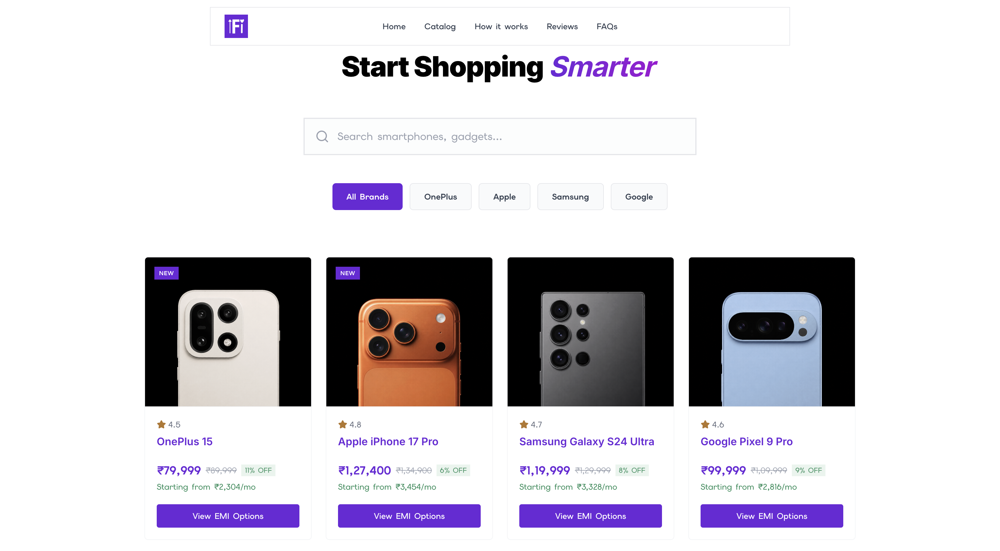
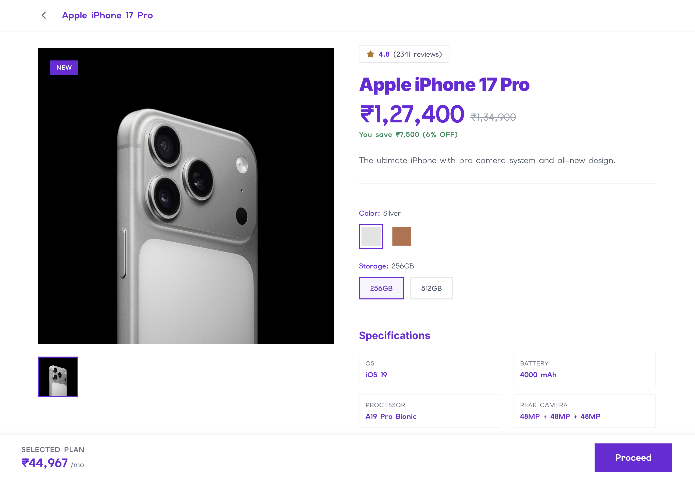
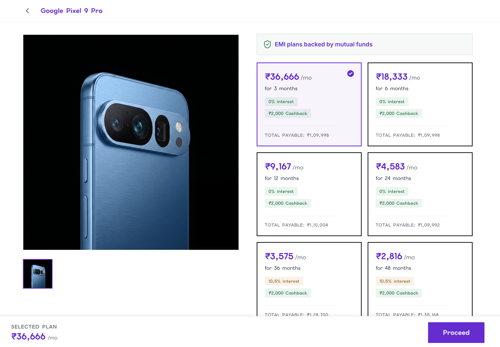

# PayLater Store

A production-quality web application that lists products and lets users pick a mutual-fund-backed EMI plan. Built closely modeled on fintech commerce pages with a clean, trustworthy aesthetic.

## Screenshots

<div align="center">
  
  
  
  
</div>

## Tech Stack
- **Framework:** Next.js 14+ (App Router, TypeScript)
- **Styling:** Tailwind CSS (v4)
- **Database:** PostgreSQL (Neon)
- **ORM:** Prisma
- **Validation:** Zod
- **Icons:** lucide-react
- **Deployment:** Vercel

## Setup & Run Locally

```bash
git clone <repo>
cd paylater-store
npm install
cp .env.example .env   # fill in DATABASE_URL with your PostgreSQL connection string
npx prisma migrate dev
npm run build          # optional, for testing production build locally
npm run dev
```

To re-run the seed script if needed:
```bash
npx tsx prisma/seed.ts
```

## API Endpoints

### `GET /api/products`
Returns all products with their default variant's starting EMI.
```json
[
  {
    "slug": "iphone-17-pro",
    "name": "Apple iPhone 17 Pro",
    "brand": "Apple",
    "image": "https://.../silver.png",
    "mrp": 134900,
    "price": 127400,
    "discountPercent": 6,
    "rating": 4.8,
    "isNew": true,
    "startingEmi": 5621
  }
]
```

### `GET /api/products/:slug`
Returns full product details, variants, and nested EMI plans.
```json
{
  "slug": "iphone-17-pro",
  "name": "Apple iPhone 17 Pro",
  "variants": [
    {
      "storage": "256GB",
      "color": "Silver",
      "emiPlans": [
        {
          "tenureMonths": 3,
          "interestRate": 0,
          "monthlyAmount": 42467,
          "cashback": 7500,
          "totalPayable": 127401
        }
      ]
    }
  ]
}
```

### `POST /api/orders`
Creates a new order application.
```json
// Request
{ 
  "variantId": "clx123...", 
  "emiPlanId": "emi_001...", 
  "customerName": "Aman Gupta", 
  "customerPhone": "9876543210" 
}

// Response
{ 
  "orderId": "clx456...", 
  "status": "initiated", 
  "message": "Your EMI application has started." 
}
```

### `GET /api/faqs`
Returns a list of all Frequently Asked Questions.
```json
[
  {
    "id": "cuid...",
    "question": "What is mutual fund backed EMI?",
    "answer": "It allows you to use your mutual funds as collateral..."
  }
]
```

### `GET /api/testimonials`
Returns a list of customer testimonials for the landing page.
```json
[
  {
    "id": "cuid...",
    "name": "Sarah J.",
    "avatar": "https://i.pravatar.cc/150?u=sarah",
    "text": "The fastest way I've ever bought a phone!"
  }
]
```

## Database Schema
The database uses Prisma and defines a core catalog structure where a `Product` has many `Variant`s, and each `Variant` has many `EmiPlan`s. Since the final price (and MRP) varies by variant, the EMI math is inherently tied to the variant level, ensuring complete accuracy across storage bumps and color variations.

```prisma
model Product {
  id          String    @id @default(cuid())
  slug        String    @unique
  name        String
  brand       String
  category    String
  description String
  specs       Json       
  rating      Float      @default(0)
  reviewCount Int        @default(0)
  isNew       Boolean    @default(false)
  createdAt   DateTime   @default(now())
  variants    Variant[]
}

model Variant {
  id          String    @id @default(cuid())
  productId   String
  product     Product   @relation(fields: [productId], references: [id], onDelete: Cascade)
  storage     String?   
  color       String    
  colorHex    String    
  mrp         Int       
  price       Int       
  imageUrl    String
  gallery     String[]  
  stock       Int       @default(25)
  isDefault   Boolean   @default(false) 
  emiPlans    EmiPlan[]

  @@unique([productId, storage, color])
}

model EmiPlan {
  id                 String   @id @default(cuid())
  variantId          String
  variant            Variant  @relation(fields: [variantId], references: [id], onDelete: Cascade)
  tenureMonths       Int
  interestRate       Float    
  monthlyAmount      Int
  cashback           Int      @default(0)
  isMutualFundBacked Boolean  @default(true)
  totalPayable       Int      

  @@index([variantId])
}

model Order {
  id           String   @id @default(cuid())
  variantId    String
  emiPlanId    String
  customerName String
  customerPhone String
  status       String   @default("initiated")
  createdAt    DateTime @default(now())
}

model FAQ {
  id        String   @id @default(cuid())
  question  String
  answer    String
  createdAt DateTime @default(now())
}

model Testimonial {
  id        String   @id @default(cuid())
  name      String
  avatar    String
  text      String
  createdAt DateTime @default(now())
}
```

## Deployment
Deployed on Vercel. Database is hosted on Neon (PostgreSQL).
Set the `DATABASE_URL` environment variable in Vercel. The `prisma generate` step runs automatically during the Vercel build due to standard Next.js + Prisma integration.
